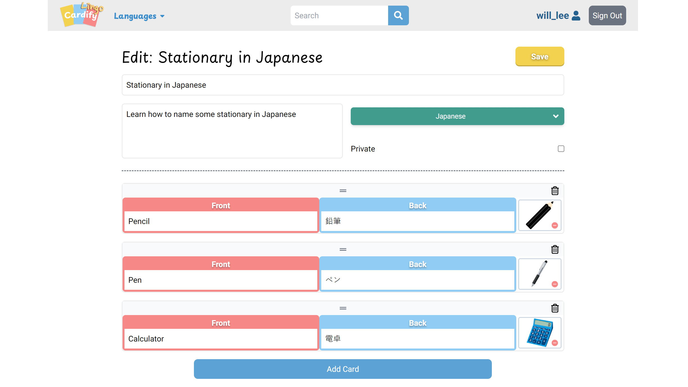

# Cardify Lingo
Cardify Lingo is a revamped version of the [Cardify](https://github.com/ritatanght/Cardify) application, focusing on language learning. Developed primarily using Next.js, Typescript, TailwindCSS, and PostgreSQL, this updated version incorporates numerous enhancements and refinements, aligning more closely with my original concepts for the application.

- [Live Demo](https://cardify-lingo.vercel.app/)

## Updates and Enhancements

- **Backend Migration:** The previous Express backend has been transformed into app/api routes using Next.js route handlers
- **New Features:**
  - Integration of Google account creation with NextAuth.js
  - Addition of a quiz feature to aid users in memorizing vocabulary and phrases through images, reading, listening, and speaking. Check out the [screenshots](#screenshots) section below for a visual representation.
  - Implementation of speech recognition for the quiz feature in compatible browsers[^1]
  - Inclusion of the option to add images to cards, users can upload or remove images on the create/edit page or in the single card edit modal

### Database Changes

- All tables (except the users table) are now prefixed with `lang_` to maintain continuity with Cardify's database and keep the service free.
- The `id` column in the users' table has been updated to the `VARCHAR` type to accommodate Google accounts' IDs.
- A new `code` column has been added to the `languages` table specifically for supporting speech synthesis and speech recognition features.

### Font Optimization

This project uses [`next/font`](https://nextjs.org/docs/basic-features/font-optimization) to automatically optimize and load Google Font.

[^1]: The Web Speech API is predominantly supported by Google browsers. Chrome (desktop) offers the smoothest experience. For more information on supported browsers, please refer to the [repository](https://github.com/JamesBrill/react-speech-recognition) of react-speech-recognition.

## Screenshots





- Three Quiz mode is available for a compatible browser (listen, read, and image)
  <table>
    <tr>
      <td>Quiz mode 'image' <br/>- Answered correctly via speech recognition</td>
       <td>Quiz mode 'read'</td>
    </tr>
    <tr>
      <td></td>
      <td></td>
    </tr>
       <td>Quiz mode 'listen'<br/>(Only available in compatible browsers)</td>
    </tr>
    <tr>
      <td></td>
    </tr>
   </table>

## Dependencies

- Node 20
- Next.js 14
- Next-Auth 4.x
- React 18
- React-dom 18
- React speech recognition
- React confetti
- React toastify
- React icons
- @headlessui/react
- @vercel/blob
- pg
- Sass
- uuid
- Bcrypt
- Axios
- TailwindCSS 3
- Typescript 5

## Deployment

- **Hosting**: Vercel
- **Database**: Vercel Postgres
- **Image Storage**: Vercel Blob

## Getting Started

1. Create `.env.local` based on `.env.local.example`
2. Install dependencies with `npm install`, then run the development server:

```bash
npm run dev
# or
yarn dev
# or
pnpm dev
# or
bun dev
```

3. Open [http://localhost:3000](http://localhost:3000) with your browser to see the result.

## Credits

The banner background image is originally from <a href="https://www.freepik.com/free-vector/flat-international-mother-language-day-background_21779356.htm#query=foreign%20language&position=45&from_view=search&track=ais&uuid=bfe0efed-8a9a-4bd5-9f24-22c0cbb42369">Freepik</a> and subsequently edited by me.
